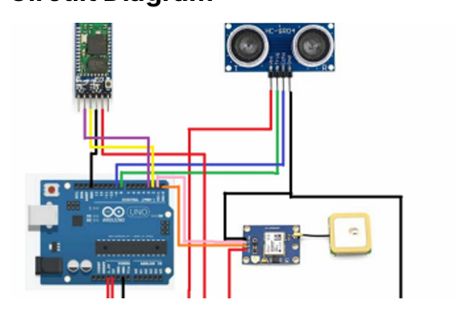

# IoT Based Pothole Detection & Alert System

## Project Overview

The IoT Based Pothole Detection & Alert System is designed to identify potholes on roads using an ultrasonic sensor and provide real-time alerts using GPS and ESP8266 communication modules. The system helps improve road safety and assists authorities in maintaining road infrastructure.

---

## Objective

The main objective of this project is to detect potholes automatically and provide real-time location-based alerts. This helps reduce accidents, improve driving safety, and support efficient road maintenance.

---

## Components Used

### Hardware Components
- Arduino Uno
- Ultrasonic Sensor
- GPS Module
- ESP8266 WiFi Module
- Motor Driver
- DC Motors
- Jumper Wires
- Power Supply/Battery

### Software Components
- Arduino IDE
- Embedded C / Arduino C
- GPS Library
- ESP8266 Library
- Serial Monitor

---

## Working Principle

1. The ultrasonic sensor continuously measures the distance between the sensor and the road surface.
2. When the measured depth exceeds a predefined threshold value, a pothole is detected.
3. Arduino Uno processes the sensor data.
4. GPS module captures the latitude and longitude coordinates.
5. ESP8266 transmits the pothole information through Wi-Fi.
6. An alert containing pothole depth and location is generated.
7. The collected information can be used for road monitoring and maintenance.

---

## Features

- Automatic pothole detection
- Real-time monitoring
- GPS location tracking
- Wireless data transmission
- Low-cost IoT solution
- Road safety improvement

---

## Circuit Diagram



---

## Future Scope

- Smart city integration
- Cloud-based monitoring system
- Mobile application notifications
- Autonomous vehicle support
- Predictive road maintenance using analytics

---

## Technologies Used

- Arduino Uno
- Embedded C
- IoT
- GPS
- ESP8266
- Ultrasonic Sensor

---

## Repository Structure

```text
IoT-Based-Pothole-Detection-and-Alert-System
│
├── Arduino_Code
│   └── pothole_detection.ino
│
├── gps_test
│   └── gps_test.ino
│
├── ultrasonic_test
│   └── ultrasonic_test.ino
│
├── Documentation
│   └── Project_Report.pdf
│
├── Images
│   └── circuit_diagram.png
│
├── README.md
│
└── LICENSE
```

---

## Author

**Shaik Rizwana**  
B.Tech Electronics and Communication Engineering  
VIT-AP University
